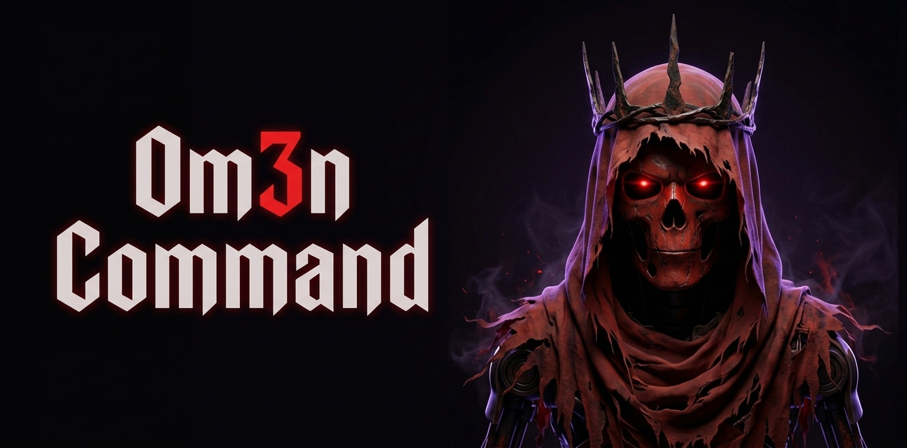
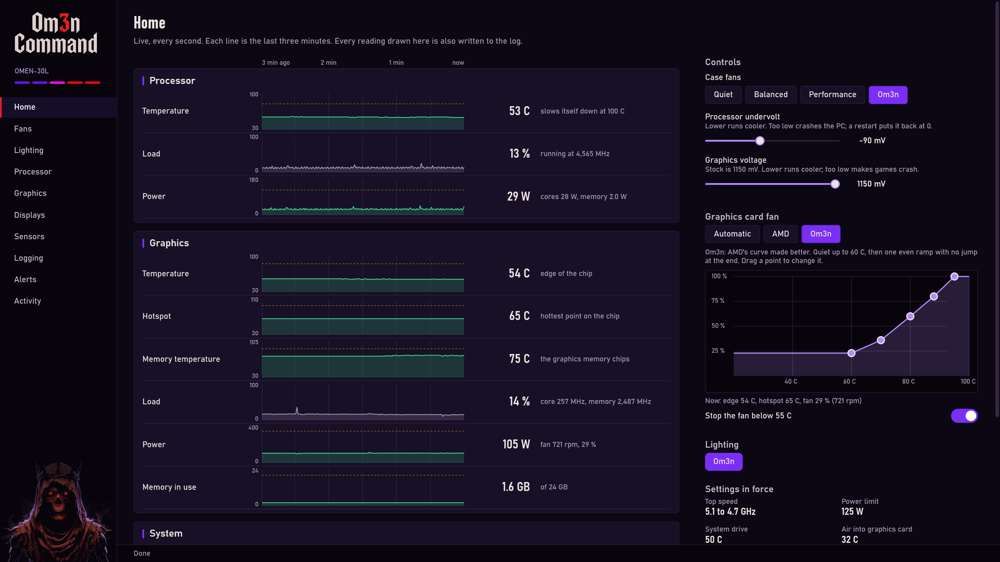

# Om3n Command

A control app for the HP OMEN 30L desktop: case fans, lighting, processor tuning, Radeon tuning and features,
display settings, live sensors and a recorder that keeps 14 days of readings. It replaces OMEN Gaming Hub and
AMD Software for those jobs and needs neither running. It is plain Windows PowerShell 5.1: `install.ps1` copies
its scripts into place and nothing else is installed.

> [!WARNING]
> **One model only.** It was written for and tested on one PC: an HP OMEN 30L (board 8703, BIOS F.30) with an
> Intel i7-10700K and a Radeon RX 7900 XTX. The fan, case lighting and memory commands talk to that board's
> BIOS and that case's lighting controller and do not carry over to another model. On any other PC, read
> [A different PC](#a-different-pc) first.
>
> **At your own risk.** Undervolting, clock and power limits and fan settings can crash a PC or let it run hot.
> Nothing here is stored in the BIOS, so a restart undoes an undervolt, but there is no warranty of any kind
> (see [LICENSE](LICENSE)).

## What it looks like

A tour of the ten pages, ten seconds each. Click it to open it full size.



One page at a time, full size: [Home](assets/screenshots/home.png) | [Fans](assets/screenshots/fans.png) | [Lighting](assets/screenshots/lighting.png) | [Processor](assets/screenshots/processor.png) | [Graphics](assets/screenshots/graphics.png) | [Displays](assets/screenshots/displays.png) | [Sensors](assets/screenshots/sensors.png) | [Logging](assets/screenshots/logging.png) | [Alerts](assets/screenshots/alerts.png) | [Activity](assets/screenshots/activity.png)

## The pages

| Page | What you do there |
|---|---|
| Home | Every reading live with its last three minutes, and the controls you reach for most |
| Fans | Quiet, Balanced, Performance, or Om3n, which switches between the three by processor temperature |
| Lighting | Saved looks, each light's colour and effect, the lights at the sign-in screen and during sleep |
| Processor | Top speed by busy cores, undervolt, memory speed |
| Graphics | Radeon features, power and clock limits, undervolt, the fan curve, 3D settings |
| Displays | Brightness, contrast, colour, HDR and scaling for each monitor |
| Sensors | Every reading with its lowest, highest and average |
| Logging | What the recorder wrote down over the last hour or up to seven days, crash and driver reset reports |
| Alerts | When the app tells you a reading runs hot |
| Activity | Every command the app has run, and what came back |

Everything the app does is one `om3n-command.ps1` command, so all of it can also be typed or scripted.

## What it needs

- Windows 10 or 11 with Windows PowerShell 5.1 (built in), and an administrator account.
- **Case lighting** needs nothing: `om3n-command-hid.ps1` writes to the lighting controller (a USB device inside the
  case) itself. No part of this tool loads anything from OMEN Gaming Hub any more.
- **CPU tuning** needs Intel's tuning service (`XTU3SERVICE`, installed as "Intel Extreme Tuning Utility"), the same
  service Gaming Hub uses for its CPU settings.
- **Radeon commands** need the AMD driver.
- Fans, RAM lighting, memory profile and sensors need nothing but Windows and this BIOS.

## Install, update, repair, uninstall

Each is one script at the top of the download, run in **PowerShell as administrator** (right-click PowerShell,
then Run as administrator) from inside the unpacked folder. If PowerShell refuses to run a script, start it as
shown, with `-ExecutionPolicy Bypass`.

**Install.** Unpack the whole download anywhere, then:

```powershell
powershell -ExecutionPolicy Bypass -File .\install.ps1
```

It copies the app to `C:\Program Files\Om3n Command`, creates the default lighting look if you have none, registers
the two tasks that start the app, puts the `Om3n Command` shortcut on your desktop and starts the app in the
notification area. The unpacked folder can be deleted afterwards. On a PC that is not an HP OMEN 30L (board 8703)
it warns and carries on: the fan, lighting and memory commands will not work there.

**Update.** Unpack the new download and run `install.ps1` from it again. It ends the running app, replaces the
files, removes files the new release no longer has, and starts the app again. Your saved looks, sign-in list, logs
and recorded readings are never overwritten.

**Repair.** When the app no longer starts, the shortcut does nothing, or a task is missing:

```powershell
powershell -ExecutionPolicy Bypass -File "C:\Program Files\Om3n Command\repair.ps1"
```

That registers every task again, rewrites the shortcut, puts the default look back if the looks file is gone,
checks every installed script and restarts the app. If a file itself is damaged (the check at the end names it),
run `repair.ps1` from a freshly unpacked download instead: it also replaces every installed file.

**Uninstall.**

```powershell
powershell -ExecutionPolicy Bypass -File "C:\Program Files\Om3n Command\uninstall.ps1"
```

It ends the app, lets OMEN Gaming Hub, HP's services and AMD Software start with Windows again if the app had
stopped them (without the app nothing else sets the fans or the lighting; `-KeepVendorOff` leaves them as they
are), removes the tasks and the shortcut and deletes `C:\Program Files\Om3n Command`. Your settings, logs and
recorded readings stay in `C:\ProgramData\SkYn3tLab`, so a later install picks them up; add `-RemoveData` to delete
them too. The fan setting and any undervolt stay as they are until Windows is restarted: neither is stored in the
BIOS, so a restart clears both.

## A different PC

Unless your PC is the same model with the same parts, expect to change the code before it is useful to you:

- **Fans, case lighting, memory speed** are tied to the OMEN 30L's board (8703) and case. On another model they
  do nothing or fail, and need that model's own BIOS commands and lighting controller.
- **The Graphics and Displays pages** go through AMD's driver, not this board, but have only been run on a
  Radeon RX 7900 XTX.
- **The Processor page** goes through Intel's tuning service, but has only been run on an i7-10700K.
- **Sensors, Logging and Alerts** read what Windows and the graphics driver offer.

If you get it working on your PC, please send the change back, so the next person with your model starts from
your work and not from nothing:

1. **Fork** this repository (the Fork button at the top of its GitHub page) to get your own copy.
2. Make your changes there, on a branch named for your model.
3. Open a **pull request** from that branch to this repository. Say which model and board you tested on (the
   board is what `(Get-CimInstance Win32_BaseBoard).Product` prints in PowerShell), what works and what does not.

A change is merged when it leaves the OMEN 30L working, so keep what is specific to your model behind a check
for your board. If you only found out what fails on your PC, open an **issue** with the same details: that is
useful too.

## The manual

[docs/MANUAL.md](docs/MANUAL.md) has every command and option, what each file is, where settings and logs
are kept, what the app does after a crash, and what this PC cannot do.

## License

[MIT](LICENSE).
